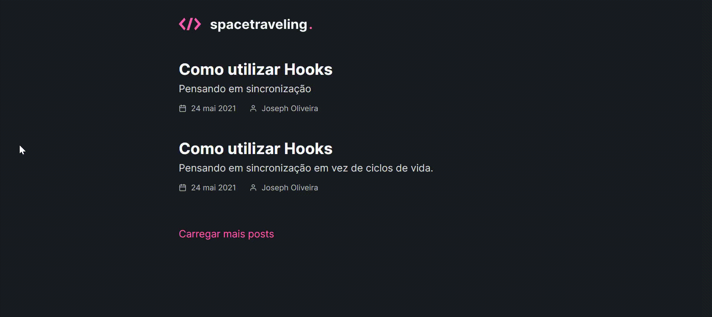

<h1 align="center">spacetraveling - Blog  👋</h1>

<p align="center"><b>Status: Concluído ✔</b></p>

## 📄 Sobre

<p> 🚀 A aplicação consiste em um blog conectado ao [Prismic CMS](https://prismic.io), desenvolvido a partir de um layout no [Figma](https://www.figma.com/file/0Y26j0tf1K2WB5c1ja5hov/Desafios-M%C3%B3dulo-3-ReactJS?node-id=0%3A1%2Fduplicate), que foi um desafio proposto durante o módulo de Fundamentos do Next do Ignite ministrado pela [Rocketseat](https://rocketseat.com.br/).</p>

## 🔝 Features

- [x] Listagem de posts.
- [x] Visualização do post completo
- [x] Integração com o [Prismic CMS](https://prismic.io)
- [x] Comentários do post com [Utteranc](https://utteranc.es/)

- Demo
  

## 🛠 Tecnologias

As seguintes tecnologias foram utilizadas na construção deste projeto:

- [React](https://pt-br.reactjs.org/)
- [NextJS](https://nextjs.org/)
- [Typescript](https://www.typescriptlang.org/)
- [SASS](https://sass-lang.com/)
- [Prismic CMS](https://prismic.io/)

## 🚀 Como executar o projeto

### Pré-requisitos

Antes de começar, você vai precisar ter instalado em sua máquina as seguintes ferramentas:
[Git](https://git-scm.com), [Node.js](https://nodejs.org/en/).
Além disto é bom ter um editor para trabalhar com o código como [VSCode](https://code.visualstudio.com/)

### 🧭 Rodando a aplicação web

```bash
# Clone este repositório
$ git clone https://github.com/brunaschneiders/ignite-reactjs-challenge5-space-traveling.git

# Acesse a pasta do projeto no seu terminal/cmd
$ cd ignite-reactjs-challenge5-space-traveling

# Instale as dependências
$ yarn install

# Execute a aplicação em modo de desenvolvimento
$ yarn dev

# A aplicação será aberta na porta:3000 - acesse http://localhost:3000
```

## Autor

👤 **Bruna Schneiders**

- Github: [@brunaschneiders](https://github.com/brunaschneiders)
- LinkedIn: [@bruna-schneiders](https://linkedin.com/in/bruna-schneiders)
